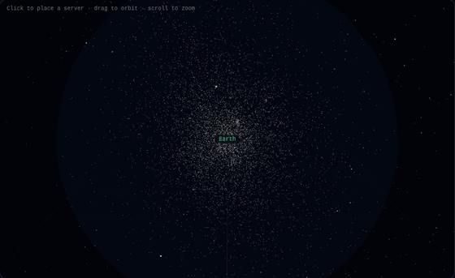
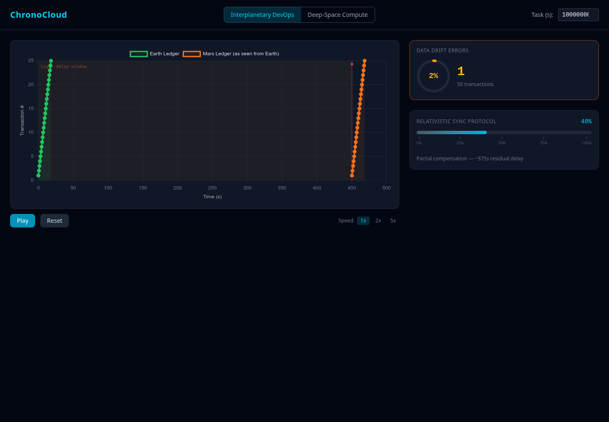

# ChronoCloud

<div align="center">



<sub><i>Deep-Space mode — zooming through 8,920 catalog stars to a server placed in a cosmic void, where weaker gravity speeds its clock; the red pulse is a message crossing the light-speed gap to Earth and back.</i></sub>

</div>

An interactive educational web application demonstrating the effects of relativistic computing and time dilation.

## Simulation Modes

- **Interplanetary DevOps** — Synchronize database ledgers between Earth and Mars, dealing with light-speed delay and micro-time drifts. Adjust a relativistic sync protocol slider to correct transaction ordering in real time.
- **Deep-Space Cloud Compute** — Place computational servers in cosmological voids where clocks tick faster than Earth's (weaker gravitational field), then balance the dilation benefit against light-speed communication latency.

## Architecture

```
React Frontend (Vite + Tailwind + Three.js + Chart.js)
  │
  ├── /api/*  →  FastAPI Backend (Python)
  │                ├── POST /api/physics/cartesian    — galactic → Cartesian coords
  │                ├── POST /api/physics/efficiency   — gravity (from catalog) + latency metrics
  │                └── GET  /api/stars                — processed HYG star catalog (with mass)
  │
  └── Star data  ←  HYG Database (8,920 stars w/ mass estimates, processed from v41)
```

## Prerequisites

- Python 3.11+
- [uv](https://docs.astral.sh/uv/) (Python package manager)
- Node.js 20+

## Setup

### Backend

```bash
cd backend
uv sync --all-extras
source .venv/bin/activate
```

### Process Star Data (one-time)

The processed `stars.json` is included in the repo. To regenerate from the raw HYG CSV:

```bash
# Download HYG v41 CSV (~32MB)
curl -L -o data/hygdata_v41.csv \
  "https://raw.githubusercontent.com/astronexus/HYG-Database/main/hyg/CURRENT/hygdata_v41.csv"

# Process into stars.json (8,920 stars at magnitude ≤ 6.5)
python scripts/process_stars.py
```

The actively maintained HYG source is at https://codeberg.org/astronexus/hyg.

### Frontend

```bash
cd frontend
npm install
```

## Development

Start the backend and frontend in separate terminals:

```bash
# Terminal 1 — Backend
cd backend
uv run uvicorn app.main:app --reload --port 8000

# Terminal 2 — Frontend
cd frontend
npm run dev
```

Open http://localhost:5173

## Simulation Modes — In Depth

### Deep-Space Cloud Compute (Far-Future Mode)

**Concept:** In a far-future scenario, humanity places computational servers in cosmological voids — vast regions of space with negligible gravitational influence. Clocks tick slower in stronger gravitational fields (general relativity), and Earth sits in the gravitational wells of the Sun and Milky Way. A server in a void experiences weaker gravity, so its clock ticks *faster* than Earth's — it can complete days of computation while only hours pass on Earth. The tradeoff: the results must travel back at light speed, and the farther the void, the longer the round-trip delay.

**Scale of the simulated universe:** The simulation includes **8,920 stars** — every star in the HYG catalog brighter than visual magnitude 6.5 (roughly the naked-eye limit). They span from the nearest at **1.3 pc** (~4.3 light-years) out through a sphere centered on Earth: the median star is ~124 pc away and **95% lie within ~560 pc** (~1,830 light-years). A handful of distant entries reach the catalog's "unknown distance" sentinel. In short, the playable volume is the bright **solar neighborhood of the Milky Way** — a sphere very roughly 1,000+ pc across, a small patch of a galaxy that is itself ~30,000 pc across. Every star also carries an estimated mass, so its gravity shapes where servers run fast or slow.

**Features:**
- **3D Galaxy Map** — An interactive star field rendered from the HYG astronomical catalog (8,920 real stars). Rotate, zoom, and pan to explore. Background stars twinkle; data stars are color-coded by luminosity (brighter stars appear warmer).
- **Server Placement (click vs. drag)** — A **single click** on the map places or moves the server; a **click-and-drag rotates** the view and leaves the server where it is. Or enter galactic coordinates (distance, longitude, latitude) in the form for precise 3D placement. The server appears as a floating, glowing cyan sphere with an orbit-ring marker and sparkles.
- **Position-dependent server gravity** — The server's clock rate is computed from the **local gravitational potential of nearby catalog stars** (masses estimated from luminosity). Place it in a deep void and its clock runs fast (a real time advantage); place it next to a bright star and that star's gravity slows it down, eroding or reversing the gain. Genuine void-hunting is rewarded.
- **Earth's Gravity Well** — Amber concentric shells surround the green Earth marker, representing the dense solar-neighborhood field that slows Earth's clock. The time-dilation advantage comes from the *difference* between Earth's slow clock and the server's clock — so the well is drawn at Earth, where it physically belongs.
- **Light-Speed Communication Line** — A dashed cyan line connects Earth to your server, carrying an animated **red signal pulse** on the round trip. Its label shows the round-trip travel time (RTT).
- **Distance Dimension Line** — A separate dashed **violet** line, offset parallel above the comm line (architectural-dimension style, so the two never overlap), with the straight-line Earth↔server distance in parsecs at its midpoint.
- **Map Key** — A legend below the metrics row explains every on-screen element (Earth, gravity well, void server, orbit marker, comm link, signal pulse, distance).
- **Metrics Dashboard** — Five cards update in real time with animated value transitions:
  - *Distance from Earth* — straight-line distance to the server in parsecs, with light-years and miles beneath (both scientific notation and a plain-language "≈ N trillion miles" phrasing); 1 pc ≈ 3.26 ly ≈ 1.92×10¹³ mi
  - *Server Clock Advantage* — how fast the server's clock ticks relative to Earth's (e.g. `1.063× Earth`), derived from its local gravity; >1 (cyan) is a void advantage, <1 (red) means it's in a denser region than Earth
  - *Earth Compute Time* — how much Earth time passes while the server completes the task
  - *Earth Wait Time* — compute time + round-trip light delay
  - *Net Gain/Loss* — whether the dilation benefit outweighs the communication cost
- **Task Duration Control** — Adjust the "Task (s)" input in the header to simulate different workload sizes. Longer tasks benefit more from time dilation.
- **Note on Scale** — The gravitational dilation effect is pedagogically exaggerated (real interstellar potentials are ~1 part in 10¹³). A documented constant scales it so the contrast between the crowded solar neighborhood and deep voids is visible and explorable.
- **Camera Fly-To** — The camera automatically frames both Earth and the server when you place one.

**What problems does it address?**
- Builds intuition for the competing forces in relativistic computing: placing a server in a gravitational void speeds up its clock relative to Earth's, but light-speed latency adds communication overhead.
- Demonstrates that "farther into the void" is not always better — at some distance, the latency cost exceeds the dilation benefit.
- Provides a hands-on way to explore the Schwarzschild metric without equations.
- Illustrates a key asymmetry: Earth's gravitational well slows our clocks, and escaping it (into a void) is computationally advantageous — the opposite of the sci-fi trope of "computing near a black hole."

**Try this:** Place a server at 1 parsec, note the Net Gain/Loss, then move it to 100 parsecs. Watch how the latency dominates at large distances even though the server's clock advantage is constant. Now increase the task duration to 1,000,000 seconds — at what distance does the dilation benefit finally overcome the latency cost?

#### Understanding the Task Workload Size

The **Task (s)** input in the header is the *size of the computational job*, expressed as a duration: how many seconds of compute the job requires on whatever machine runs it. (It only affects this Deep-Space mode; the Interplanetary ledger mode ignores it.)

**What it represents:** Think of it as "this job needs *N* seconds of CPU time to finish." A small value like `3600` (1 hour) is a quick job; a large value like `1e12` (≈31,700 years) is a massive batch computation. It is a proxy for workload size measured in time rather than FLOPs or rows. The model assumes the **same job costs the same number of compute-seconds on either machine** (identical hardware), each measured in that machine's *own* clock — what differs is how fast those clocks tick relative to Earth.

**Why it's the key lever:** Task size determines whether offloading to a void server actually pays off. From the efficiency formula:

$$
\text{net gain} = \underbrace{t_\text{task} \cdot (1 - f_\text{earth})}_{\text{dilation benefit (scales with size)}} - \underbrace{t_\text{latency}}_{\text{fixed cost}}
$$

- The **dilation benefit** grows linearly with task size. A faster-ticking void server saves a *percentage* of the runtime (~5% with the default well), so the bigger the job, the more absolute time saved.
- The **latency cost** is fixed — it depends only on distance, not job size. You pay the same round-trip light delay whether the job is tiny or enormous.

So there is a **break-even task size**: below it, the fixed communication overhead dominates and offloading is a net loss; above it, the dilation savings overtake the latency and you come out ahead. This is why the walkthrough screenshot needs a $10^{12}$ s task to show a positive net gain at 20 pc — a 1-hour job at that distance would be a massive net loss.

**Real-world analogy:** It is the same calculus as deciding whether to ship a job to a distant data center. The network round-trip is a fixed tax, so it is only worth paying if the job is big enough that the remote machine's advantage (here, a faster clock; in reality, cheaper or faster hardware) outweighs the transit cost. Small jobs stay local; large jobs justify the trip.

---

### Interplanetary DevOps (Near-Future Mode)

**Concept:** In a near-future scenario, Earth and Mars each run database ledgers. Transactions originate on both planets, but Mars transactions take ~12.5 minutes (750 seconds) to reach Earth at light speed. Without compensation, Earth sees Mars transactions arriving late, causing ordering conflicts — a transaction that happened first on Mars might appear to happen after a later Earth transaction. The Relativistic Sync Protocol applies timestamp compensation to correct this.

**Features:**
- **Ledger Timeline Chart** — A Chart.js visualization showing Earth transactions (green) and Mars transactions (orange) plotted over time. Mars transactions are offset by the light-delay window. As you adjust the sync slider, the Mars line smoothly animates to its corrected position.
- **Light-Delay Zone** — A semi-transparent orange band on the chart represents the time window where Mars transactions are "in flight." The band shrinks as you increase sync compensation, directly visualizing the protocol's effect.
- **Conflict Markers** — Red dots and bands appear at exact timestamps where transaction ordering breaks down. These disappear as you increase compensation.
- **Data Drift Counter** — An SVG ring gauge showing accumulated ordering errors as both a count and percentage. Color transitions from green (no errors) through amber to red (high drift, with a glow effect).
- **Relativistic Sync Protocol Slider** — A gradient-tracked slider from 0% (no compensation) to 100% (full compensation) with tick marks and a dynamic description explaining the physics at each position.
- **Transaction Replay** — Press Play to watch transactions arrive in real time with a cyan playhead sweeping across the chart. The drift counter updates live as each transaction is processed. Speed controls (1x, 2x, 5x) let you watch at different rates. Pause, resume, or reset at any time.

**What problems does it address?**
- Demonstrates the real engineering challenge of distributed systems across light-speed delays — the same class of problem that GPS satellites solve today (GPS clocks are corrected for both gravitational and velocity-based time dilation).
- Shows why naive timestamp comparison fails in interplanetary networks and why protocols must account for propagation delay.
- Illustrates causality violations: a transaction that "happened first" can arrive second, breaking assumptions that underpin most database consistency models (e.g., last-write-wins).

**Try this:** Start with the slider at 0% and press Play. Watch the drift counter climb as Mars transactions arrive out of order. Pause, drag the slider to 100%, and replay — the conflicts disappear. Now try 50% — partial compensation reduces but doesn't eliminate drift. This is the core tradeoff real mission planners face.

## Example Walkthrough

### Deep-Space Cloud Compute


This capture shows a server deployed at **400 pc** (a deep void) with a **10¹³ second** workload (set via the *Task (s)* field in the header). Reading the screen:

- The **green marker** at the center is Earth, wrapped in **amber gravity-well shells** (the field that slows Earth's clock). The **cyan sphere** with an orbit ring is the deployed server. A dashed cyan **communication line** carries a **red signal pulse** on the round trip; a parallel **violet distance line** marks the separation. A **Map Key** below the metrics labels every element.
- The **metrics row** shows the result: *Distance* 400 pc, a *Server Clock Advantage* of **1.063× Earth** (the void's weak gravity makes the server's clock run faster), *Earth Compute Time* and *Wait Time* in the ~300,000-year range, and a **positive Net Gain of ~16,000 yr** (green) — offloading wins here.
- Move the server next to a bright star and the Clock Advantage drops below 1.0× (red) — its local gravity now slows it *below* Earth's rate, turning the gain into a loss. That's the void-vs-mass tradeoff the new physics models.

### Interplanetary DevOps



This capture shows the ledger timeline with the **Relativistic Sync Protocol at 40%**. Reading the screen:

- **Green points** are Earth transactions; **orange points** are Mars transactions as seen from Earth, shifted right by the residual light delay. The faint **orange band** on the left is the light-delay window — it shrinks as you increase compensation.
- The **red dot** near the top marks a causality conflict (a transaction that arrived out of order). The **ring gauge** on the right reports the drift: 1 error across 50 transactions (2%).
- The slider description reads *"Partial compensation — ~375s residual delay."* Drag it to 100% and the conflict and drift clear; drag to 0% and they grow.
- Press **Play** to replay the transactions in real time with a sweeping playhead, at 1x/2x/5x speed.

## Physics & Assumptions

All physics lives in [`backend/app/services/physics.py`](backend/app/services/physics.py) as pure functions. This section documents each formula, its derivation, and the simplifying assumptions the simulation makes. The math is textbook-correct; some **parameters are deliberately exaggerated** for visibility, as noted below.

### Constants

| Symbol | Value | Meaning |
|--------|-------|---------|
| $c$ | $299{,}792.458\ \text{km/s}$ | Speed of light |
| $G$ | $6.674 \times 10^{-11}\ \text{m}^3\,\text{kg}^{-1}\,\text{s}^{-2}$ | Gravitational constant |
| $M_\odot$ | $1.989 \times 10^{30}\ \text{kg}$ | Solar mass |
| $1\ \text{pc}$ | $3.086 \times 10^{13}\ \text{km}$ | Parsec |

### 1. Galactic → Cartesian conversion

Converts a server's galactic coordinates — distance $d$ (parsecs), longitude $l$, latitude $b$ — into Cartesian coordinates for 3D rendering. This is the standard spherical-to-Cartesian transformation, where $b$ is the elevation above the galactic plane and $l$ is the azimuth:

$$
x = d \cos(b)\cos(l), \qquad
y = d \cos(b)\sin(l), \qquad
z = d \sin(b)
$$

### 2. Light-speed latency

Round-trip communication time from Earth at the origin to a server at $(x, y, z)$, in parsecs. The factor of 2 accounts for the round trip (dispatch the task, receive the result):

$$
t_\text{latency} = \frac{2 \, d}{c}, \qquad d = \sqrt{x^2 + y^2 + z^2}\ \ (\text{converted to km})
$$

*Verification:* a server 1 pc away yields a 6.52-year round trip, consistent with 1 pc ≈ 3.26 light-years one way.

### 3. Gravitational time dilation (weak-field, from the star catalog)

Both Earth and the server sit in the **same field of catalog stars**, so the model uses the weak-field metric: a clock at gravitational potential $\Phi$ ticks at rate

$$
\frac{d\tau}{dt} = \sqrt{1 + \frac{2\Phi}{c^2}}
$$

relative to flat spacetime. The potential at any point is the softened Newtonian sum over all catalog stars (masses estimated per §3a):

$$
\Phi(\mathbf{r}) = -\sum_i \frac{G M_i}{\sqrt{|\mathbf{r} - \mathbf{r}_i|^2 + \epsilon^2}}
$$

where $\epsilon$ is a softening length ($0.1\ \text{pc}$) that keeps the potential finite if a server is placed right on top of a star. **Earth's** factor $f_\text{earth}$ is this evaluated at the origin — the dense solar neighborhood, so Earth's clock runs slow. The **server's** factor $f_\text{server}$ is evaluated at its placement: in a deep void $\Phi \to 0$ and $f_\text{server} \to 1$ (fast); near other stars $\Phi$ deepens and $f_\text{server}$ drops, eroding or reversing the advantage. This is the "place it in a void, not next to a star" physics.

> **Exaggeration:** real interstellar potentials produce dilation of ~1 part in $10^{13}$ — invisible. The code multiplies $2\Phi/c^2$ by a documented constant (`GRAVITY_EXAGGERATION`) so the spread between the crowded solar neighborhood and deep voids becomes a visible few-to-tens-of-percent effect, and caps the well depth so the factor stays real.

### 3a. Stellar mass estimate (mass–luminosity relation)

The data pipeline estimates each star's mass from its catalog luminosity $L$ (solar units) using the main-sequence mass–luminosity relation, clamped to $0.1$–$50\ M_\odot$:

$$
\frac{M}{M_\odot} = \left(\frac{L}{L_\odot}\right)^{1/3.5}
$$

This is crude — it treats every star as main-sequence, ignoring giants, white dwarfs, and binaries — but it is enough to make void-hunting physically meaningful.

### 4. Computation efficiency

Given a task requiring `task_seconds` of compute (in the local clock of whichever machine runs it), the model compares running it locally on Earth versus offloading to the server:

$$
t_\text{compute} = t_\text{task} \cdot \frac{f_\text{earth}}{f_\text{server}}, \qquad
t_\text{wait} = t_\text{compute} + t_\text{latency}, \qquad
\text{net gain} = t_\text{task} - t_\text{wait}
$$

The server completes the task in $t_\text{task}$ of its own proper time; the Earth time that elapses meanwhile is $t_\text{task} \cdot (f_\text{earth}/f_\text{server})$. When the server's clock is faster ($f_\text{server} > f_\text{earth}$, i.e. a weaker field) Earth ages less, so the work effectively finishes sooner — but you still wait $t_\text{latency}$ for the round trip. The **clock advantage** reported in the UI is $f_\text{server}/f_\text{earth}$ (>1 = the server runs faster than Earth). A **positive net gain** means offloading beats local execution.

### 6. Interplanetary light delay (Near-Future mode)

Earth–Mars one-way signal delay is pure light-travel time (no relativity involved):

$$
t_\text{delay} = \frac{d_\text{Earth–Mars}}{c}
$$

With $d_\text{Earth–Mars} = 2.25 \times 10^8\ \text{km}$ (a realistic mid-range distance; the true range is 55–401 million km), this gives **750 s ≈ 12.5 min**. A Mars transaction at timestamp $t$ appears on Earth at $t + t_\text{delay}(1 - \text{syncOffset})$, where the sync slider applies compensation from 0 (none) to 1 (full).

### Assumptions & Caveats

These are intentional simplifications. They keep the simulation legible, but a physicist should know where it departs from reality:

1. **The gravitational dilation is exaggerated in scale.** Real interstellar potentials produce dilation of ~1 part in $10^{13}$. The `GRAVITY_EXAGGERATION` constant scales this into a visible few-to-tens-of-percent effect so the contrast between the crowded solar neighborhood and deep voids is explorable. Relative differences between locations are meaningful; the absolute magnitude is not.

2. **Stellar masses are a crude estimate.** Masses come from a main-sequence mass–luminosity relation ($M = L^{1/3.5}$, clamped to 0.1–50 $M_\odot$), which mis-estimates giants, white dwarfs, and binaries. Good enough for relative potential, not for precision astrophysics.

3. **"Void = far away" is partly a catalog artifact.** The catalog is magnitude-limited (only stars brighter than mag 6.5), so star density falls off with distance from Earth. That makes distant regions read as low-potential voids — roughly true for the solar neighborhood vs. intergalactic space, but amplified by the cutoff.

4. **Net gain still requires large tasks.** Light latency grows with distance while the clock advantage saturates, so a positive net gain needs a big enough task to amortize the round trip. This is the genuine tradeoff the dashboard is built to show — small jobs at large distances correctly read as net losses.

5. **Two coordinate systems share one 3D scene.** Catalog stars are placed from equatorial coordinates (RA/Dec), while servers use galactic longitude/latitude. Both produce valid Cartesian points, but their axes are not physically aligned, so a server's position does not correspond to the true galactic-frame location of nearby stars. This is cosmetic — but note the gravitational potential is computed in the same Cartesian frame the stars are stored in, so the relative geometry used for physics is self-consistent.

6. **"Relativistic Sync Protocol" is loosely named.** The Near-Future mode models *signal-propagation delay* and event-ordering correction (Lamport-clock territory), **not** relativistic time dilation. The genuine (tiny) Earth–Mars clock difference is correctly ignored. The mechanism is "relativistic" only in that it is bounded by $c$.

7. **Identical hardware is assumed.** The efficiency model assumes a task costs the same number of compute-seconds wherever it runs, measured in that machine's local clock. Differences in actual server performance are out of scope.

## Project Structure

```
chronocloud/
├── backend/
│   ├── app/
│   │   ├── main.py              # FastAPI entry point
│   │   ├── routers/             # /api/stars, /api/physics/*
│   │   ├── services/physics.py  # 5 pure relativistic math functions
│   │   └── models/schemas.py    # Pydantic request/response models
│   ├── scripts/process_stars.py # HYG CSV → stars.json pipeline
│   ├── data/stars.json          # 8,920 processed stars
│   └── tests/                   # 17 unit tests
└── frontend/
    └── src/
        ├── components/
        │   ├── far-future/      # GalaxyMap, ServerPlacer, MetricsDash
        │   └── near-future/     # LedgerTimeline, DriftCounter, SyncSlider
        ├── hooks/useSimulation.js
        └── data/near-future-ledger.json  # 50 mock transactions
```

## Tests

```bash
cd backend
uv run pytest tests/ -v
```
