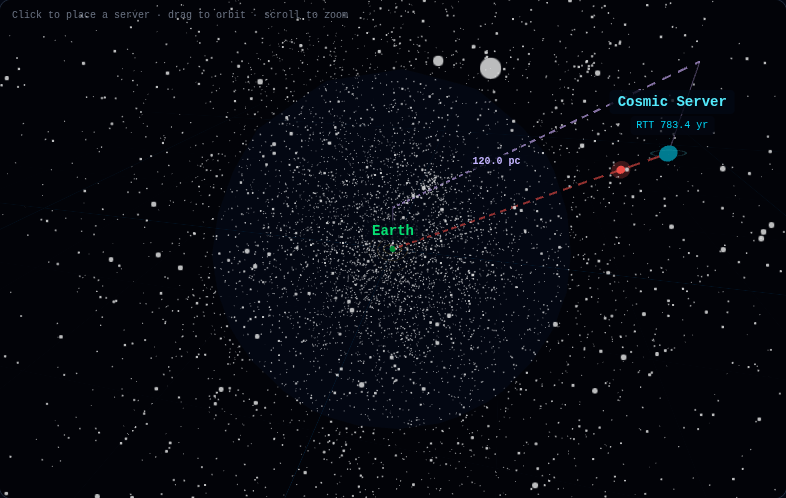
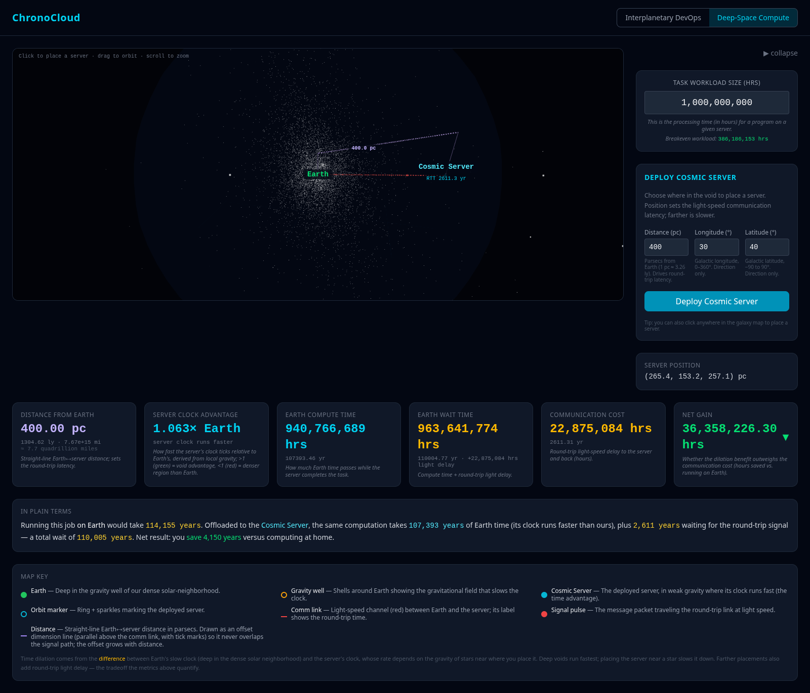

<div align="center">

<h1 align="center">🌀 a matter of time ⌛</h1>

> An interactive tool for exploring the time dilation between any two reference frames with differing gravitational potentials (General Relativity).
> ***Can time dilation be used as a computational resource?*** So far, I don't think so.   
>                          ...but what if?


[](https://github.com/tottenjordan/void-ranger/actions/workflows/tests.yml)


<sub><i>The Deep-Space dashboard in action — deploy a compute server in a cosmic void and watch its clock advantage, light-delay, and net time gain update live as the signal pulses between Earth and the server across 8,920 catalog stars.</i></sub>

</div>

## Table of Contents

- [Overview](#overview)
- [Architecture](#architecture)
- [Prerequisites](#prerequisites)
- [Setup](#setup)
- [Development](#development)
- [How It Works](#how-it-works)
- [Glossary](docs/GLOSSARY.md)
- [Deep dives](docs/README.md): [Gravitational Field Model](docs/gravitational-field.md) · [Efficiency & Breakeven](docs/efficiency-model.md) · [Light-Speed Latency](docs/light-latency.md) · [Void Finding](docs/void-finding.md) · [Cosmic Web scale](docs/cosmic-web.md)
- [Physics and Assumptions](#physics-and-assumptions)
- [TODO](#todo)
- [Project Structure](#project-structure)
- [Tests](#tests)

## Overview

Void Ranger is a single-purpose **Deep-Space Cloud Compute** simulator: place a compute server in a cosmological void — a vast region where the weaker gravitational field makes its clock tick faster than Earth's — then weigh that time-dilation advantage against the light-speed communication latency of reaching it. The deeper the void, the faster the server's clock, but the longer the round-trip signal takes, so the sweet spot depends on the size of the job.

It runs at **two scales**, switched with a toggle in the top bar: **Solar Neighborhood** (~8,920 stars within a few hundred parsecs) and **Cosmic Web** (~43,500 galaxies out to hundreds of megaparsecs, where the void finder targets *real* cosmic voids). Same physics, zoomed out by ~a million. See [The Cosmic Web scale](docs/cosmic-web.md).

## Architecture

```
React Frontend (Vite + Tailwind + Three.js) — Solar Neighborhood / Cosmic Web scales
  │
  ├── /api/*  →  FastAPI Backend (Python)
  │                ├── POST /api/physics/cartesian    — galactic → Cartesian coords
  │                ├── POST /api/physics/efficiency   — dilation + latency metrics + breakeven (scale: solar|cosmic)
  │                ├── POST /api/physics/best-void     — deepest-void search (scale-aware)
  │                ├── POST /api/physics/best-spot     — max net-gain placement (scale-aware)
  │                ├── GET  /api/stars                — HYG star catalog (solar scale; mass + names)
  │                └── GET  /api/galaxies             — 2MRS galaxy catalog (cosmic scale)
  │
  └── Catalogs  ←  HYG (8,920 stars, parsecs) · 2MRS (43,510 galaxies, megaparsecs)
```

## Prerequisites

- Python 3.11+
- [uv](https://docs.astral.sh/uv/) (Python package manager)
- Node.js 20+

## Setup

<details>
<summary><b>Show backend, star-data, and frontend setup steps</b></summary>

### Backend

```bash
cd backend
uv sync --all-extras
source .venv/bin/activate
```

### Process Star Data (one-time)

The processed `stars.json` is included in the repo. To regenerate from the raw HYG CSV:

```bash
# Download HYG v41 CSV (~32MB)
curl -L -o data/hygdata_v41.csv \
  "https://raw.githubusercontent.com/astronexus/HYG-Database/main/hyg/CURRENT/hygdata_v41.csv"

# Process into stars.json (8,920 stars at magnitude ≤ 6.5)
python scripts/process_stars.py
```

The actively maintained HYG source is at https://codeberg.org/astronexus/hyg.

### Process Galaxy Data (one-time, Cosmic Web scale)

The processed `galaxies.json` is included in the repo. To regenerate it, fetch the
**2MASS Redshift Survey** (VizieR `J/ApJS/199/26`) — `astroquery` is installed
with `uv sync --all-extras`:

```bash
# Pull 2MRS from VizieR and process into galaxies.json (~43,500 galaxies, Mpc)
uv run python scripts/process_galaxies.py
```

See [The Cosmic Web scale](docs/cosmic-web.md) for the catalog and physics details.

### Frontend

```bash
cd frontend
npm install
```

</details>

## Development

Start the backend and frontend in separate terminals:

```bash
# Terminal 1 — Backend
cd backend
uv run uvicorn app.main:app --reload --port 8000

# Terminal 2 — Frontend
cd frontend
npm run dev
```

Open http://localhost:5173

## How It Works

**Concept:** In a far-future scenario, humanity places computational servers in cosmological voids — vast regions of space with negligible gravitational influence. Clocks tick slower in stronger gravitational fields (general relativity), and Earth sits in the gravitational wells of the Sun and Milky Way. A server in a void experiences weaker gravity, so its clock ticks *faster* than Earth's — it can complete days of computation while only hours pass on Earth. The tradeoff: the results must travel back at light speed, and the farther the void, the longer the round-trip delay.

**Scale of the simulated universe:** The simulation includes **8,920 stars** — every star in the HYG catalog brighter than visual magnitude 6.5 (roughly the naked-eye limit). They span from the nearest at **1.3 pc** (~4.3 light-years) out through a sphere centered on Earth: the median star is ~124 pc away and **95% lie within ~560 pc** (~1,830 light-years). A handful of distant entries reach the catalog's "unknown distance" sentinel. In short, the playable volume is the bright **solar neighborhood of the Milky Way** — a sphere very roughly 1,000+ pc across, a small patch of a galaxy that is itself ~30,000 pc across. Every star also carries an estimated mass, so its gravity shapes where servers run fast or slow.

**Features:**

#### Explore & place a server


<sub><i>Drag anywhere to orbit the interactive star field; a single click drops a server at that spot, and the camera flies in to frame Earth and the new Cosmic Server (a click-and-drag rotates the view instead of placing).</i></sub>

- **3D Galaxy Map** — An interactive star field rendered from the HYG astronomical catalog (8,920 real stars). Rotate, zoom, and pan to explore; background stars twinkle and data stars are color-coded by luminosity (brighter stars appear warmer).
- **Server placement (click vs. drag)** — A **single click** on the map places or moves the server; a **click-and-drag** rotates the view and leaves the server where it is. Or enter galactic coordinates (distance, longitude, latitude) in the form for precise 3D placement.
- **Top-bar controls over the map** — The Task Workload field, breakeven readout, and Server Position sit in a compact top bar, and the **Deploy Cosmic Server** and **Find a spot** controls open as collapsible dropdown panels that float over the 3D map instead of pushing it aside. With the Map Key as a thin strip along the bottom, the whole dashboard fits on one screen without scrolling.
- **Camera fly-to** — The camera automatically frames both Earth and the server when you place one.
- **Auto-find a spot** — Two one-click finders that search within an adjustable radius: **Find deepest void** (the emptiest pocket — lowest local gravity, fastest clock) and **Best spot for this task** (maximizes net gain, balancing the clock advantage against light-delay latency for your current Task Workload Size). How it works: [Void Finding](docs/void-finding.md).

#### What's on the map



<sub><i>A server placed 120 pc out: Earth (green, wrapped in its amber gravity well) at center-left, the cyan Cosmic Server with its RTT label at right, the red round-trip communication line between them, and the violet distance line labeling the separation.</i></sub>

- **Earth & its gravity well** — A green marker for Earth, wrapped in amber concentric shells that represent the dense solar-neighborhood field slowing Earth's clock. The time-dilation advantage comes from the *difference* between Earth's slow clock and the server's — so the well is drawn at Earth, where it belongs.
- **Cosmic Server** — The deployed server: a floating, glowing cyan sphere with a bold **"Cosmic Server"** label and its **RTT** (round-trip time) beneath it, so the latency to that location is readable right on the map.
- **Orbit marker (orbit-ring)** — A decorative cyan ring with drifting sparkles around the Cosmic Server, marking its position so it's easy to spot among the 8,920 stars. A **visual locator only** — not a real orbit, and it carries no physics.
- **Light-speed communication line** — A dashed **red** line from Earth to the server, carrying an animated **red signal pulse** on the round trip; its label shows the round-trip travel time (RTT).
- **Distance dimension line** — A separate dashed **violet** line, offset parallel above the comm line (architectural-dimension style, so the two never overlap), labeled with the straight-line Earth↔server distance in parsecs. The offset is deliberate (not a glitch) and **scales with distance** (≈18%, with a small floor), so far placements sit noticeably higher above the red comm line.
- **Star labels** — The map auto-labels the **brightest named stars currently in view** (up to 8, e.g. Sirius, Vega, Arcturus) — the set updates as you orbit and zoom, so a region's notable stars surface without cluttering the field. **Hover any star** (named or not) for a tooltip with its name or catalog designation, constellation, distance, and apparent magnitude.
- **Map Key** — A legend below the metrics row explaining every on-screen element.

#### Find deepest void


<sub><i>One click on **Find deepest void** searches the volume within the radius for the emptiest pocket — the point farthest from <em>all</em> catalog stars (lowest gravitational potential) — and drops the server there.</i></sub>

**Find deepest void** hunts for the location with the **lowest local gravity** inside your search radius — the emptiest gap between stars, *not* simply the point farthest from Earth. Weaker gravity means a faster clock, so this maximizes the raw **Server Clock Advantage** regardless of task size. (It ignores latency, so a very deep void can still be a net loss for small jobs — that's what *Best spot for this task* accounts for.) How it works: [Void Finding](docs/void-finding.md).

#### Best spot for this task


<sub><i>**Best spot for this task** balances a void's clock advantage against the light-delay latency of reaching it for your current Task Workload Size, then places the server where the net time saved is greatest.</i></sub>

**Best spot for this task** maximizes **Net Gain** for your *current* Task Workload Size — it weighs a void's clock advantage against the round-trip light delay of reaching it. Bigger tasks justify deeper, farther voids (more compute to amortize the latency); smaller tasks favor closer spots. Change the Task Workload Size and the best spot can move. How it works: [Void Finding](docs/void-finding.md).

#### Set the workload & read the results
- **Task Workload Size field** — A wide, comma-formatted input in the top bar (entered in years, with the days equivalent beneath), setting the size of the computational job; longer tasks benefit more from time dilation. See [Understanding the Task Workload Size](#understanding-the-task-workload-size).
- **Position-dependent server gravity** — The server's clock rate is computed from the **local gravitational potential of nearby catalog stars** (masses estimated from luminosity). A deep void runs fast (a real advantage); next to a bright star, that star's gravity slows it down, eroding or reversing the gain. This is what drives the *Server Clock Advantage*. Full details (formula, softening, worked example): [Gravitational Field Model](docs/gravitational-field.md).
- **Metrics dashboard** — Six cards update live, each with a one-line description; time values are shown in years with a days equivalent beneath and a colored ▲/▼:
  - *Distance from Earth* — straight-line distance in parsecs (plus light-years and miles)
  - *Server Clock Advantage* — how fast the server's clock ticks vs. Earth's (e.g. `1.063× Earth`); >1 (cyan) = void advantage, <1 (red) = denser region than Earth
  - *Earth Compute Time* — Earth time elapsed while the server computes
  - *Communication Cost* — the round-trip light delay (the fixed cost the dilation advantage must overcome)
  - *Earth Wait Time* — compute time + round-trip light delay
  - *Net Gain/Loss* — whether the dilation benefit outweighs the communication cost (▲ gain / ▼ loss)
- **Breakeven workload readout** — In the top bar beside the Task field once a server is placed: the smallest task whose dilation savings cover the round-trip delay at that location ("none" where the spot has no advantage). Green when your task clears it, red otherwise.
- **In plain terms panel** — A plain-language summary below the metrics that translates the numbers into relatable units (e.g. *"this job would take ~114,000 years on Earth; offloaded it finishes in ~110,000 years — a net saving of ~4,150 years."*). A **"Show the math"** toggle reveals the live step-by-step formulas (clock advantage, Earth compute, comm cost, wait, net gain, breakeven) computed from the current placement — see [Efficiency & Breakeven](docs/efficiency-model.md).
- **Note on scale** — The gravitational dilation is pedagogically **exaggerated** (real interstellar potentials are ~1 part in 10¹³); a documented constant scales it so the contrast between the crowded neighborhood and deep voids is explorable.

#### What it teaches
- Builds intuition for the competing forces in relativistic computing: placing a server in a gravitational void speeds up its clock relative to Earth's, but light-speed latency adds communication overhead.
- Demonstrates that "farther into the void" is not always better — at some distance, the latency cost exceeds the dilation benefit.
- Provides a hands-on way to explore the Schwarzschild metric without equations.
- Illustrates a key asymmetry: Earth's gravitational well slows our clocks, and escaping it (into a void) is computationally advantageous — the opposite of the sci-fi trope of "computing near a black hole."

**Try this:** Place a server at 1 parsec, note the Net Gain/Loss, then move it to 100 parsecs. Watch how the latency dominates at large distances even though the server's clock advantage is constant. Now increase the Task Workload Size into the hundreds of thousands of years — at what distance does the dilation benefit finally overcome the latency cost?

#### Understanding the Task Workload Size

The **Task Workload Size** input in the top bar is the *size of the computational job*, expressed as a duration: how many **years** of compute the job requires on whatever machine runs it.

**What it represents:** Think of it as "this job needs *N* years of CPU time to finish." A small value like `1` (one year) is a modest job; a large value like `1,000,000` (a million years) is a massive batch computation. It is a proxy for workload size measured in time rather than FLOPs or rows. The model assumes the **same job costs the same amount of compute time on either machine** (identical hardware), each measured in that machine's *own* clock — what differs is how fast those clocks tick relative to Earth. (Internally the physics works in seconds; the field is entered in years and the metric cards show years with a days equivalent beneath.)

**Why it's the key lever:** Task size determines whether offloading to a Cosmic Server actually pays off. From the efficiency formula:

$$
\text{net gain} = \underbrace{t_\text{task} \cdot \left(1 - \frac{f_\text{earth}}{f_\text{server}}\right)}_{\text{dilation benefit (scales with size)}} - \underbrace{t_\text{latency}}_{\text{fixed cost}}
$$

- The **dilation benefit** grows linearly with task size. A faster-ticking Cosmic Server saves a *percentage* of the runtime (~5% with the default well), so the bigger the job, the more absolute time saved.
- The **latency cost** is fixed — it depends only on distance, not job size. You pay the same round-trip light delay whether the job is tiny or enormous.

So there is a **break-even task size** — $t_\text{latency} / (1 - f_\text{earth}/f_\text{server})$ — below it, the fixed communication overhead dominates and offloading is a net loss; above it, the dilation savings overtake the latency and you come out ahead. The dashboard computes this value for the clicked location and shows it as the **Breakeven workload** under the Task field (green once your task size clears it, red otherwise; "none" where the spot has no time advantage). This is why the walkthrough screenshot needs an enormous task (~114,000 years) to show a positive net gain at a deep-void distance — a one-year job out there would be a massive net loss.

**Real-world analogy:** It is the same calculus as deciding whether to ship a job to a distant data center. The network round-trip is a fixed tax, so it is only worth paying if the job is big enough that the remote machine's advantage (here, a faster clock; in reality, cheaper or faster hardware) outweighs the transit cost. Small jobs stay local; large jobs justify the trip.

#### Example Walkthrough



<sub><i>The full Deep-Space dashboard: a Cosmic Server deployed in a deep void at 400 pc, with the six-card metrics row (years over days) and the "In plain terms" summary below the map. Annotated walkthrough below.</i></sub>

This capture shows a server deployed at **400 pc** (a deep void) with a **114,155-year** workload (~41.7 million days, set via the *Task Workload Size (yrs)* field in the top bar). Reading the screen:

- The **green marker** at the center is Earth, wrapped in **amber gravity-well shells** (the field that slows Earth's clock). The **cyan sphere** with an orbit ring is the deployed **Cosmic Server**, labeled with its RTT. A dashed **red communication line** carries a **red signal pulse** on the round trip; a parallel **violet distance line** marks the separation. A **Map Key** in the controls row labels every element.
- After placing the server, the **Breakeven workload** readout under the Task field shows the smallest task that pays off here, and the metrics row's **Communication Cost** card shows the round-trip light delay.
- The **metrics row** shows the result: *Distance* 400 pc, a *Server Clock Advantage* of **1.063× Earth** (the void's weak gravity makes the server's clock run faster), an *Earth Compute Time* of ~107,393 years and *Earth Wait Time* of ~110,005 years, and a **positive Net Gain of ~4,150 years** (green) — offloading wins here. (Each card shows years as the main value with the days equivalent beneath; the model computes in seconds internally.)
- The **In plain terms** panel below the metrics translates that into relatable units: *running this job on Earth would take ~114,000 years; offloaded to the Cosmic Server the same computation takes ~107,000 years of Earth time plus ~2,600 years of signal round-trip — a total ~110,000-year wait, a net saving of ~4,150 years.*
- Move the server next to a bright star and the Clock Advantage drops below 1.0× (red) — its local gravity now slows it *below* Earth's rate, turning the gain into a loss. That's the void-vs-mass tradeoff the physics models.

#### Show the math

The *In Plain Terms* panel has a **"Show the math"** toggle that expands the live, step-by-step calculation behind the summary — recomputed for the current placement and color-coded to match the metric cards.

> **Heads-up — the clock advantage and Earth compute lines use reciprocal ratios.** *Clock advantage* is `f_server / f_earth` (e.g. `1.0478×`), but *Earth compute* scales the task by the flipped ratio `f_earth / f_server` (e.g. `0.95437`). They're the same number inverted (`0.95437 = 1 / 1.0478`), because `Earth compute = task ÷ advantage` — a faster clock means *less* Earth time passes. See [Efficiency & Breakeven](docs/efficiency-model.md#why-the-clock-ratio-is-f_earth--f_server).


<sub><i>Every value the dashboard shows is derived here: clock advantage = f_server / f_earth; Earth compute = task × (f_earth / f_server); Earth wait = compute + comm cost; net gain = task − wait; breakeven = comm cost ÷ (1 − f_earth/f_server). Full derivation in [Efficiency & Breakeven](docs/efficiency-model.md).</i></sub>

#### Cosmic Web scale

The top-bar **Solar Neighborhood ↔ Cosmic Web** toggle swaps the whole dashboard to a galaxy-scale universe: ~43,500 galaxies from the 2MASS Redshift Survey out to a few hundred **megaparsecs**, with distances and the search radius in Mpc. Everything else is the same — place a node, read the metrics, run the finders — but now **"Find deepest void" targets real cosmic voids**, and the brightest *named* galaxies (Andromeda, Centaurus A, Sombrero, …) are labeled while hovering any galaxy shows its catalog designation, distance, and magnitude.

Because round-trip latency at these distances is enormous (hundreds of millions to billions of years), most placements correctly read as a net loss — only a huge job in a *nearby* void comes out ahead, which is exactly the trade-off the simulator exists to show. The physics is the same weak-field model with a galaxy catalog and a much smaller exaggeration (void-vs-cluster dilation is a real effect). Full write-up: [The Cosmic Web scale](docs/cosmic-web.md).

## Physics and Assumptions

All physics lives in [`backend/app/services/physics.py`](backend/app/services/physics.py) as pure functions. This section documents each formula, its derivation, and the simplifying assumptions the simulation makes. The math is textbook-correct; some **parameters are deliberately exaggerated** for visibility, as noted below. For quick one-line definitions of every on-screen metric and term, see the [Glossary](docs/GLOSSARY.md). For deep dives, see the [Gravitational Field Model](docs/gravitational-field.md) (how the field is computed at any coordinate, including near other stars), the [Efficiency & Breakeven](docs/efficiency-model.md) math, and the [Light-Speed Latency](docs/light-latency.md) model.

### Constants

| Symbol | Value | Meaning |
|--------|-------|---------|
| `c` | 299,792.458 km/s | Speed of light |
| `G` | 6.674 × 10⁻¹¹ m³·kg⁻¹·s⁻² | Gravitational constant |
| `M☉` | 1.989 × 10³⁰ kg | Solar mass |
| `1 pc` | 3.086 × 10¹³ km | Parsec |

### 1. Galactic → Cartesian conversion

Converts a server's galactic coordinates — distance $d$ (parsecs), longitude $l$, latitude $b$ — into Cartesian coordinates for 3D rendering. This is the standard spherical-to-Cartesian transformation, where $b$ is the elevation above the galactic plane and $l$ is the azimuth:

$$
x = d \cos(b)\cos(l), \qquad y = d \cos(b)\sin(l), \qquad z = d \sin(b)
$$

### 2. Light-speed latency

Round-trip communication time from Earth at the origin to a server at $(x, y, z)$, in parsecs. The factor of 2 accounts for the round trip (dispatch the task, receive the result):

$$
t_\text{latency} = \frac{2 \, d}{c}, \qquad d = \sqrt{x^2 + y^2 + z^2}\ \ (\text{converted to km})
$$

*Verification:* a server 1 pc away yields a 6.52-year round trip, consistent with 1 pc ≈ 3.26 light-years one way.

### 3. Gravitational time dilation (weak-field, from the star catalog)

Both Earth and the server sit in the **same field of catalog stars**, so the model uses the weak-field metric: a clock at gravitational potential $\Phi$ ticks at rate

$$
\frac{d\tau}{dt} = \sqrt{1 + \frac{2\Phi}{c^2}}
$$

relative to flat spacetime. The potential at any point is the softened Newtonian sum over all catalog stars (masses estimated per §3a):

$$
\Phi(\mathbf{r}) = -\sum_i \frac{G M_i}{\sqrt{|\mathbf{r} - \mathbf{r}_i|^2 + \epsilon^2}}
$$

where $\epsilon$ is a softening length ($0.1\ \text{pc}$) that keeps the potential finite if a server is placed right on top of a star. **Earth's** factor $f_\text{earth}$ is this evaluated at the origin — the dense solar neighborhood, so Earth's clock runs slow. The **server's** factor $f_\text{server}$ is evaluated at its placement: in a deep void $\Phi \to 0$ and $f_\text{server} \to 1$ (fast); near other stars $\Phi$ deepens and $f_\text{server}$ drops, eroding or reversing the advantage. This is the "place it in a void, not next to a star" physics.

> **Exaggeration:** real interstellar potentials produce dilation of ~1 part in $10^{13}$ — invisible. The code multiplies $2\Phi/c^2$ by a documented constant (`GRAVITY_EXAGGERATION`) so the spread between the crowded solar neighborhood and deep voids becomes a visible few-to-tens-of-percent effect, and caps the well depth so the factor stays real.

### 3a. Stellar mass estimate (mass–luminosity relation)

The data pipeline estimates each star's mass from its catalog luminosity $L$ (solar units) using the main-sequence mass–luminosity relation, clamped to $0.1$–$50\ M_\odot$:

$$
\frac{M}{M_\odot} = \left(\frac{L}{L_\odot}\right)^{1/3.5}
$$

This is crude — it treats every star as main-sequence, ignoring giants, white dwarfs, and binaries — but it is enough to make void-hunting physically meaningful.

### 4. Computation efficiency

Given a task requiring `task_seconds` of compute (in the local clock of whichever machine runs it), the model compares running it locally on Earth versus offloading to the server:

$$
t_\text{compute} = t_\text{task} \cdot \frac{f_\text{earth}}{f_\text{server}}, \qquad t_\text{wait} = t_\text{compute} + t_\text{latency}, \qquad \text{net gain} = t_\text{task} - t_\text{wait}
$$

The server completes the task in $t_\text{task}$ of its own proper time; the Earth time that elapses meanwhile is $t_\text{task} \cdot (f_\text{earth}/f_\text{server})$. When the server's clock is faster ($f_\text{server} > f_\text{earth}$, i.e. a weaker field) Earth ages less, so the work effectively finishes sooner — but you still wait $t_\text{latency}$ for the round trip. The **clock advantage** reported in the UI is $f_\text{server}/f_\text{earth}$ (>1 = the server runs faster than Earth). A **positive net gain** means offloading beats local execution.

### Assumptions & Caveats

These are intentional simplifications. They keep the simulation legible, but a physicist should know where it departs from reality:

1. **The gravitational dilation is exaggerated in scale.** Real interstellar potentials produce dilation of ~1 part in $10^{13}$. The `GRAVITY_EXAGGERATION` constant scales this into a visible few-to-tens-of-percent effect so the contrast between the crowded solar neighborhood and deep voids is explorable. Relative differences between locations are meaningful; the absolute magnitude is not.

2. **Stellar masses are a crude estimate.** Masses come from a main-sequence mass–luminosity relation ($M = L^{1/3.5}$, clamped to 0.1–50 $M_\odot$), which mis-estimates giants, white dwarfs, and binaries. Good enough for relative potential, not for precision astrophysics.

3. **"Void = far away" is partly a catalog artifact.** The catalog is magnitude-limited (only stars brighter than mag 6.5), so star density falls off with distance from Earth. That makes distant regions read as low-potential voids — roughly true for the solar neighborhood vs. intergalactic space, but amplified by the cutoff.

4. **Net gain still requires large tasks.** Light latency grows with distance while the clock advantage saturates, so a positive net gain needs a big enough task to amortize the round trip. This is the genuine tradeoff the dashboard is built to show — small jobs at large distances correctly read as net losses.

5. **Two coordinate systems share one 3D scene.** Catalog stars are placed from equatorial coordinates (RA/Dec), while servers use galactic longitude/latitude. Both produce valid Cartesian points, but their axes are not physically aligned, so a server's position does not correspond to the true galactic-frame location of nearby stars. This is cosmetic — but note the gravitational potential is computed in the same Cartesian frame the stars are stored in, so the relative geometry used for physics is self-consistent.

6. **Identical hardware is assumed.** The efficiency model assumes a task costs the same number of compute-seconds wherever it runs, measured in that machine's local clock. Differences in actual server performance are out of scope.

## TODO

- [x] **Reach beyond the solar neighborhood** — added the **Cosmic Web** scale (~43,500 2MRS galaxies, megaparsecs). See [The Cosmic Web scale](docs/cosmic-web.md).
- [ ] **Cosmic Web big-data (Phase 2)** — scale from 2MRS to **GLADE+** (~22.5M galaxies) via a GCP pipeline (BigQuery → GCS/CDN binary LOD tiles + a precomputed potential grid + octree streaming). Design: [Scaling the Universe](docs/scaling-the-universe.md).
- [ ] **Deeper star catalog** — the Solar Neighborhood scale uses ~8,920 HYG stars (magnitude ≤ 6.5). Relax the cut / switch to AT-HYG for a denser local field.

## Project Structure

```
void-ranger/
├── backend/
│   ├── app/
│   │   ├── main.py                  # FastAPI entry point + router wiring
│   │   ├── routers/                 # stars.py (/api/stars, /api/galaxies), physics.py (/api/physics/*)
│   │   ├── services/
│   │   │   ├── physics.py           # scale-parameterized physics: dilation, latency, efficiency, void search
│   │   │   └── catalog.py           # cached star/galaxy catalog loaders
│   │   └── models/schemas.py        # Pydantic request/response models
│   ├── scripts/
│   │   ├── process_stars.py         # HYG CSV → stars.json (solar scale)
│   │   └── process_galaxies.py      # 2MRS via VizieR → galaxies.json (cosmic scale)
│   ├── data/
│   │   ├── stars.json               # 8,920 stars (parsecs)
│   │   └── galaxies.json            # 43,510 galaxies (megaparsecs)
│   └── tests/                       # 36 unit tests (physics, stars, galaxies)
├── frontend/
│   └── src/
│       ├── App.jsx                  # renders Layout + FarFutureView
│       ├── components/Layout.jsx    # header/shell
│       ├── components/far-future/   # FarFutureView (scale toggle), GalaxyMap, MetricsDash,
│       │                            #   ServerPlacer, VoidFinder, Popover
│       └── utils/format.js          # year/day + unit formatting helpers
└── docs/                            # GLOSSARY + deep dives: gravitational-field, efficiency-model,
                                     #   light-latency, void-finding, cosmic-web, scaling-the-universe
```

## Tests

```bash
cd backend
uv run pytest tests/ -v
```
