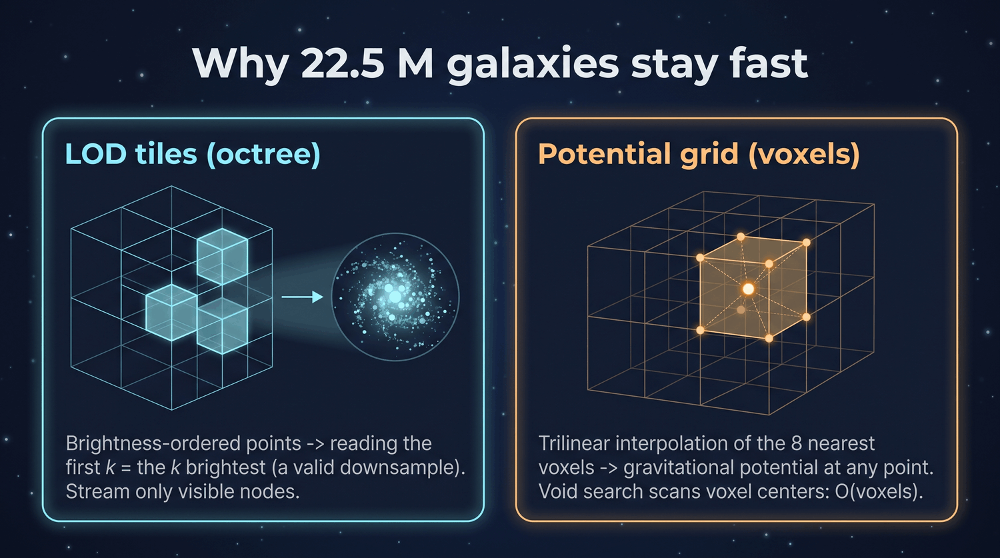
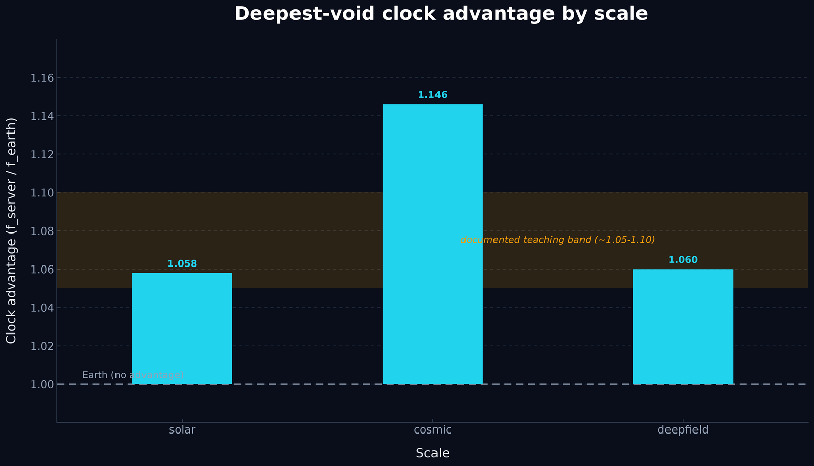
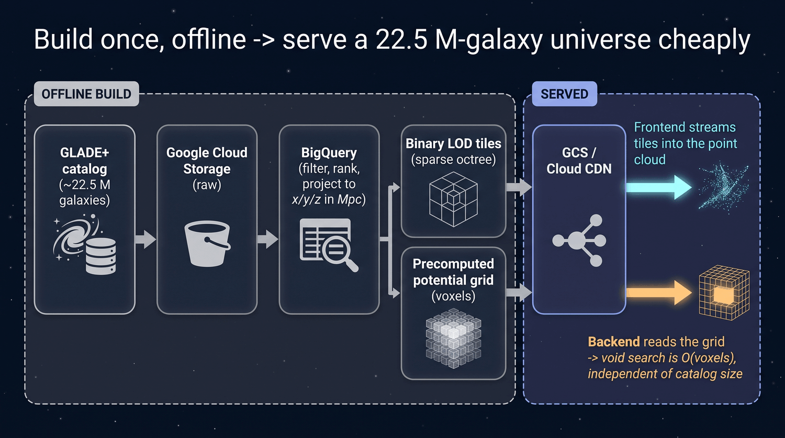

# The Deep Field scale

Void Ranger runs at three **scales**, switched by the toggle in the top bar:

- **Solar Neighborhood** — ~8,920 stars within ~560 pc (the default; see the
  [Gravitational Field Model](gravitational-field.md)).
- **Cosmic Web** — ~43,500 galaxies out to a few hundred **megaparsecs**, served
  as one JSON and drawn as a single point cloud (see
  [The Cosmic Web scale](cosmic-web.md)).
- **Deep Field** — **GLADE+** (~22.5 M galaxies), megaparsecs, streamed as
  binary level-of-detail (LOD) tiles with a precomputed potential grid behind the
  physics. A genuine big-data visualization: GCP-ready, but runnable locally from
  committed sample assets.

Same premise at every scale: weaker local gravity → a faster clock → a job
finishes in less home time, traded off against light-speed latency. The Deep
Field keeps the Cosmic Web's megaparsec units and weak-field model, but replaces
the "one JSON, one point cloud, sum-over-every-object" approach with the three
pieces that make 22.5 M galaxies tractable: **binary LOD tiles**, **octree
streaming**, and a **precomputed potential grid** that turns the void search into
an O(voxels) lookup independent of catalog size.

> One-line definitions of the jargon below (GLADE+, LOD tile, octree/octant,
> voxel grid, trilinear interpolation) live in the
> [Glossary](GLOSSARY.md#deep-field-scale).

## The catalog (GLADE+)

The galaxies come from **GLADE+** (VizieR `VII/291`,
<https://glade.elte.hu/>) — **23,181,758 rows**:

- **Not every row has a usable distance.** GLADE+ mixes objects with and without
  reliable distances; the pipeline keeps **only rows with a usable luminosity
  distance `d_L ≤ R_MAX`**. The kept 3-D set is therefore smaller than the full
  catalog — we report the kept count rather than implying full coverage.
- **Completeness** is roughly ~44 Mpc in the B band and out to ~500 Mpc in the
  W1 (mid-infrared) band — which is why the volume is bounded at ±500 Mpc (see
  [The ±500 Mpc bound](#the-500-mpc-bound)).
- **Brightness ranking** uses the apparent W1 magnitude where available, falling
  back to B then K (lower magnitude = brighter). This ordering is what makes a
  *prefix* of any tile a valid downsample (see [Binary tile format](#binary-tile-format-tilesnodeidbin)).
- **Cartesian position** in **Mpc** uses the same RA/Dec → x,y,z convention as
  the stars and 2MRS galaxies (`x = d·cos(dec)·cos(ra)`, etc.).
- A **deterministic ~100k-row sample**
  (`backend/data/samples/glade_sample.csv.gz`) drives local pipeline development,
  the committed tileset/grid, and the tests — no network or GCP dependency is
  needed to build and run the Deep Field.

## The two binary formats

The Deep Field ships two kinds of precomputed asset: **LOD tiles** the frontend
streams into the point cloud, and a **potential grid** the backend reads for
physics and the void search. Both are deterministic — same input → byte-identical
output (no RNG, fixed dtypes, stable sorts).



<sub><i>Two precomputed assets keep 22.5 M galaxies fast: brightness-ordered octree LOD tiles (any prefix is a valid downsample) and a voxel potential grid queried by trilinear interpolation.</i></sub>

### Binary tile format (`tiles/<nodeId>.bin`)

Each tile is a **headerless little-endian Float32** buffer of interleaved
`x, y, z` in Mpc — **3 floats (12 bytes) per galaxy**, so a tile's point count is
`byteLength / 12`. Browsers are little-endian, so the frontend decodes a tile
with a direct `new Float32Array(buf)` — no `DataView`, no byte-swapping. (The
builder round-trips every tile through `<f4` as a self-check.)

Points inside a tile are **brightness-ordered**, so any **prefix is a valid
downsample** — reading the first *k* points gives you the *k* brightest galaxies
in that node.

The tiles form a **sparse octree**, described by `tiles/manifest.json`:

```json
{
  "unit": "Mpc",
  "root": "0",
  "nodes": {
    "0":  { "bounds": [minx,miny,minz,maxx,maxy,maxz], "count": 40000,
            "children": ["00","01", ...], "file": "0.bin" },
    "00": { "bounds": [...], "count": 12345, "children": [...], "file": "00.bin" }
  }
}
```

- Node ids: root is `"0"`; a child **appends its octant digit** `0..7`
  (e.g. `"00"`, `"071"`). Octant bit order: bit 0 = x, bit 1 = y, bit 2 = z
  (0 = low half).
- The octree is **sparse**: only non-empty children are listed. A node keeps its
  brightest `cap` (default 40,000) points and recurses into 8 octant children
  only while it holds more than `cap` and depth < `max_depth` (default 6).
- `bounds` are `[minx, miny, minz, maxx, maxy, maxz]` in Mpc; `count` is the
  number of points actually written to that node's `.bin`.

Because coarse (parent) and fine (child) levels intentionally overlap — a parent
re-lists the brightest points that also appear in its children — the **sum of
per-node counts is *not* the unique galaxy count**; it's a LOD-overlap total.

Built by `backend/scripts/glade/build_tiles.py`.

### Potential grid format (`grid/grid.npy` + `grid/grid.json`)

`grid/grid.npy` is a NumPy **float32** array of shape `(nz, ny, nx)` holding the
**raw** softened Newtonian potential magnitude in **J/kg** — *not*
pre-exaggerated (see [Calibration & physics](#calibration--physics)). The sidecar
`grid/grid.json` carries the geometry:

```json
{ "bounds": [minx, miny, minz, maxx, maxy, maxz], "shape": [nz, ny, nx], "unit": "Mpc" }
```

- `bounds` are the cube **face extents** (±R_MAX), not voxel-center extremes.
- The array is indexed `grid[iz, iy, ix]`; the voxel center along an axis is
  `center(i) = lo + (i + 0.5) · (hi − lo) / n`.
- The backend reads `.npy` and **trilinearly interpolates** the value at any
  point, so the potential is defined everywhere in the cube (points past the
  outermost voxel centers clamp to the nearest edge — no extrapolation, no NaN).

The committed sample grid is coarse — **N = 48** (`48³ × 4 B ≈ 432 KB`); the full
GCP run uses N = 64 (~1 MB). Built by `backend/scripts/glade/build_grid.py`,
mirroring `local_potential` / `_potential_at` in
`backend/app/services/physics.py` exactly (same `G`, `MPC_M`, `M_SUN_KG`, and
`softening = 0.5 Mpc`).

## The O(voxels) grid void search (the key big-data idea)

At the Cosmic Web scale, *Find deepest void* and *Best spot* evaluate the
softened potential by **summing over every catalog object at every candidate
point** — `O(grid × N)`. That's fine at 2MRS's ~43.5 k galaxies; at GLADE+'s
22.5 M it would fall over.

The Deep Field sidesteps this entirely. Because the potential is **precomputed on
a voxel grid**, the searches become array reductions over the grid's voxel
centers (within the latency-budget ball), **independent of the 22.5 M catalog
size**:

- **Find deepest void** → `argmin` of the grid potential over voxel centers.
- **Best spot for this task** → per-voxel `argmax` of
  `task · (1 − f_earth/f_server) − 2d/c` — the same net-gain objective as the
  other scales, evaluated against the grid.

Both are **O(voxels)** — flat as the catalog grows. This is the central big-data
move: a one-time offline aggregation (summing 22.5 M galaxies into a small grid)
buys an interactive, catalog-size-independent search at runtime.
(`find_deepest_void` / `find_best_spot` in
`backend/app/services/physics.py` take the grid path when the scale's catalog
loader is `None`, i.e. for `deepfield`.)

## The ±500 Mpc bound

The Deep Field is capped to a **±R_MAX Mpc cube** (default **R_MAX = 500**). Both
the tiles and the grid are clipped to this cube. This is a **tractability +
completeness** choice, **not physics**:

- **Completeness** — GLADE+'s W1-band completeness roughly holds to ~500 Mpc, so
  beyond it the field would be increasingly an artifact of the survey's flux
  limit rather than real structure.
- **Tractability** — bounding the volume keeps the octree tileset and the
  potential grid small enough to ship and stream.

It is *not* a claim about where the universe (or its voids) ends — just the slice
the Deep Field renders honestly and cheaply.

## Calibration & physics

The Deep Field uses the **same weak-field model** as the other scales, with the
catalog sum replaced by the grid lookup. Per the `SCALES` registry in
`backend/app/services/physics.py`:

| Quantity | Cosmic | Deep Field |
|---|---|---|
| Length unit | megaparsec | megaparsec |
| Softening `ε` | 0.5 Mpc | 0.5 Mpc |
| Potential source | catalog sum over 2MRS (`O(grid × N)`) | **precomputed grid** (trilinear, `O(voxels)`) |
| Exaggeration | `1.0e5` (fixed) | **auto-derived per grid** (target advantage `1.06`) |

The clock factor is `f = √(1 + 2Φ/c²)` with the softened potential
`Φ = −Σ G·Mᵢ/√(r²+ε²)`; Earth (our vantage point) sits at the origin;
`f_server / f_earth` is the **clock advantage**; latency is `2d/c`; and
`Earth Compute / Wait / Net Gain / Breakeven` follow the
[Efficiency & Breakeven](efficiency-model.md) math unchanged
(`earth_compute_time = task · f_earth/f_server`).

**The exaggeration lives once.** The grid stores the **raw** potential (J/kg);
the deepfield exaggeration is applied **uniformly in `gravitational_dilation`**,
not baked into the grid. Keeping it out of the grid avoids double-exaggeration —
the grid builder's `--exaggeration` flag therefore defaults to `1.0` for the
committed asset.

**Calibration (auto-derived per grid).** The exaggeration is **not a hardcoded
constant**; it is **auto-derived from the loaded grid** so the *deepest void*
within `DEEPFIELD_CALIB_RADIUS` (300 Mpc) lands a clock advantage of
`DEEPFIELD_TARGET_ADVANTAGE` (≈ **1.06**) for **any** grid — the committed ~20 k
sample *and* the 3.5 M full-catalog grid alike. Because the raw potential Φ scales
with catalog density, a single fixed factor that calibrated the sample saturated
the `max_well_depth = 0.7` clamp on a denser grid (both Earth and the void hit
`√0.3`), collapsing the advantage to 1.0. The auto-derivation eliminates that: it
solves the closed form

```
ex = (A² − 1) / (k · (A² · Φ_earth − Φ_void))
```

(with `k = 2/c²`, `A` = target advantage, `Φ_earth` = interpolated potential at
the origin, `Φ_void` = the minimum voxel potential within the calibration radius)
so the deepest void hits the target band with **no saturation**, on either grid.
The tunable knob is now the **intuitive target advantage**, not an opaque
magnitude. Intuition for the value: too low → advantage ≈ 1.0 (invisible);
in band → 1.05–1.10 (visible but modest); too high → both Earth and the void
saturate `√0.3` and the contrast again collapses to 1.0. On the committed sample
this auto-derives to ≈ **799,270** (reproducing the previous hand-tuned constant
to ~0.1 %); on a ~100× denser grid it scales itself down (≈ **7,100**) with Earth
not saturated.

As with the solar and cosmic scales, the exaggeration is a **labeled teaching
device**: time dilation is **void-favoring** (a server in a deep void runs faster
than Earth, advantage > 1; placed near catalog mass it runs slower, advantage
< 1), the *relative* contrast between voids and dense regions is faithful, but the
absolute magnitude is scaled for visibility. Real void-vs-cluster potential
differences are minuscule.



<sub><i>Deepest-void clock advantage (f_server / f_earth) by scale: solar 1.058, cosmic 1.146, deep-field 1.060 — within the documented ~1.05–1.10 teaching band.</i></sub>

## The pipeline & architecture

The Deep Field is a **GCP-ready offline pipeline** feeding a **local-first**
runtime:

```
GLADE+ (VII/291, ~22.5M)  ─>  GCS (raw)  ─>  BigQuery (filter / rank / spatial-bin)
                                                  │
                                                  ├─ octree LOD .bin tiles + manifest.json
                                                  └─ 3-D potential voxel grid (.npy + .json)
                                                  ▼
                                          GCS bucket  (+ Cloud CDN)  — static, cacheable
                                                  ▼
   Frontend streams coarse→fine tiles directly from the asset base (CDN in prod)
   Backend physics + void search read the small potential grid (no 22.5M sum)
```



<sub><i>The offline Deep Field pipeline: GLADE+ → GCS → BigQuery → binary LOD tiles + a precomputed potential grid → GCS/CDN; the frontend streams tiles and the backend reads the grid.</i></sub>

- **Offline pipeline** — GLADE+ → GCS → BigQuery → (octree LOD `.bin` tiles +
  3-D potential voxel grid) → GCS / Cloud CDN. A one-time aggregation; the
  runtime never touches the full catalog.
- **Frontend** — streams tiles directly from a **static asset base** selected via
  `VITE_ASSET_BASE_URL` (default `/deepfield`): the committed
  `frontend/public/deepfield/` sample folder in dev, a CDN URL in production. No
  `/api/*` round-trip for tiles.
- **Backend** — physics and the void search read the small potential grid
  (`backend/data/samples/deepfield/grid/`, overridable via the
  `DEEPFIELD_GRID_DIR` env var) instead of summing 22.5 M galaxies, so the API
  stays tiny.

**Local-first guarantee.** The repo builds and runs the Deep Field from the
committed sample alone — `build_tiles.py` / `build_grid.py` regenerate the sample
assets, and `npm run dev` streams them with no network or GCP dependency. The full
GCP provisioning (buckets, BigQuery, exports, CDN) is a **separate, documented,
user-run suite** under `backend/scripts/glade/gcp/` (see its `DEPLOY.md`) — it
exists, but its internals are out of scope for this doc.

## How the frontend streams it

The Deep Field renderer is `frontend/src/components/far-future/DeepField.jsx`;
`GalaxyMap` selects it for the `deepfield` scale and `StarField` for solar/cosmic.

1. **Manifest first.** On mount it fetches `tiles/manifest.json` from `assetBase`,
   then loads the **root tile** for an immediate coarse cloud.
2. **Refine on zoom.** A throttled (~4 Hz) LOD walk projects each node's
   **bounding sphere** against the camera frustum, prunes off-screen subtrees,
   and refines a node into its children when its apparent screen size crosses a
   threshold. A **refine/coarsen hysteresis** deadband stops a node from flapping
   refine↔coarsen at the boundary (which would rebuild the GPU buffer every tick).
3. **One merged buffer.** Active tiles are merged into a single `<points>`
   position buffer, **capped at 300k points**; when the chosen LOD set exceeds the
   cap it drops the deepest/farthest nodes first (and logs the drop).

Fetches are de-duped, cached per node, and abortable; hover tooltips are disabled
above a point-count threshold so dense buffers don't stutter.

## Caveats (Deep Field-specific)

1. **Partial distance coverage.** Most of GLADE+'s 22.5 M rows lack a reliable
   distance; only rows with a usable `d_L ≤ R_MAX` enter the 3-D set. The Deep
   Field shows the kept subset, not the whole catalog.
2. **Grid-resolution potential.** The void search resolves to the voxel grid
   (sample N = 48, full N = 64) and trilinear interpolation between voxel
   centers — coarser than the per-galaxy sum, but the trade for catalog-size
   independence.
3. **Bounded volume.** The ±500 Mpc cube is a tractability/completeness choice,
   not a physical edge (see [The ±500 Mpc bound](#the-500-mpc-bound)).
4. **Still a teaching exaggeration.** An **auto-derived** exaggeration scales the
   dilation for visibility (deepest-void advantage ≈ 1.06, in the 1.05–1.10 band,
   on any grid); the trade-off structure is faithful, the absolute percentages are
   not.
5. **"Earth" = our vantage point.** As at the Cosmic Web scale, the origin marker
   labeled "Earth" really means the Milky Way / Local Group; we keep the "Earth"
   noun for consistency with the metric cards.

## Code map

| Piece | Location |
|---|---|
| GLADE+ sample | `backend/data/samples/glade_sample.csv.gz` |
| Tile builder (octree LOD `.bin` + manifest) | `backend/scripts/glade/build_tiles.py` |
| Grid builder (raw potential `.npy` + `.json`) | `backend/scripts/glade/build_grid.py` |
| Committed sample tiles (served to the frontend) | `frontend/public/deepfield/tiles/` |
| Committed sample grid (read by the backend) | `backend/data/samples/deepfield/grid/` |
| Scale registry + grid-backed physics + O(voxels) search | `SCALES["deepfield"]`, `_grid_potential_at`, `find_deepest_void` / `find_best_spot` — `backend/app/services/physics.py` |
| Grid loader (`.npy` + sidecar, `DEEPFIELD_GRID_DIR` override) | `load_potential_grid`, `_deepfield_grid_dir` — `backend/app/services/catalog.py` |
| API | `scale="deepfield"` on `/api/physics/efficiency`, `/best-void`, `/best-spot` |
| Streaming renderer | `frontend/src/components/far-future/DeepField.jsx` |
| Scale toggle + `assetBase` / `VITE_ASSET_BASE_URL` | `SCALE_UI` in `frontend/src/components/far-future/FarFutureView.jsx` |
| GCP provisioning suite (separate, user-run) | `backend/scripts/glade/gcp/` (`DEPLOY.md`) |
