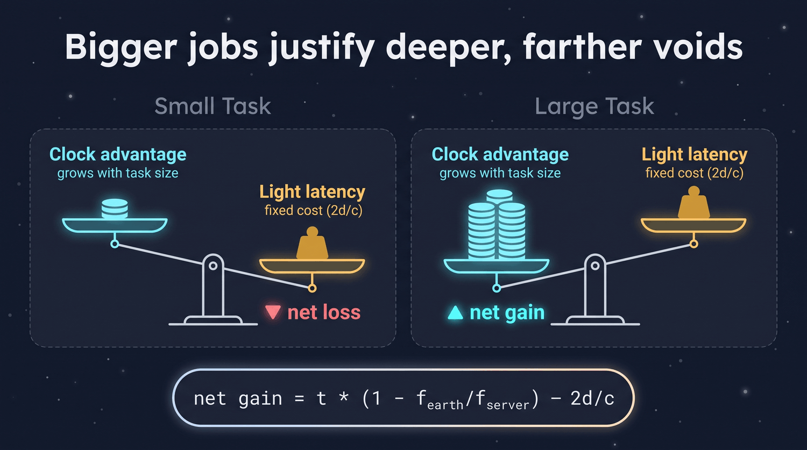
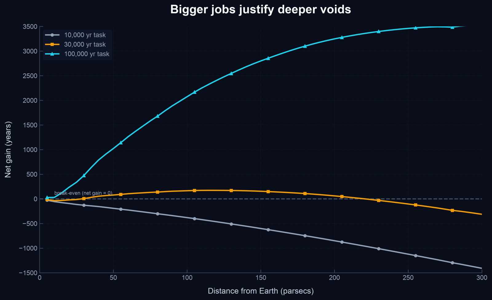
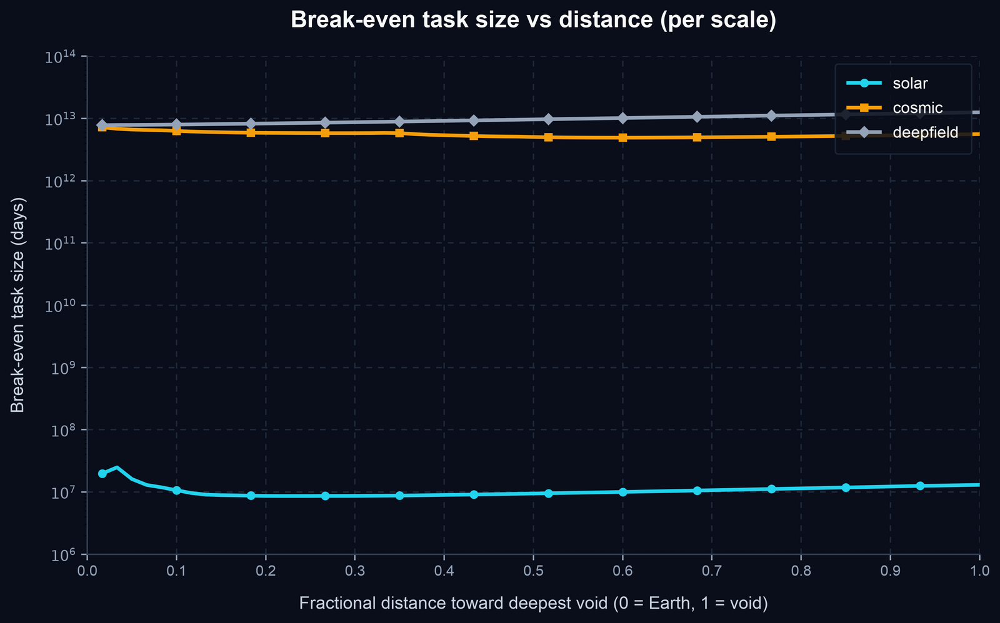
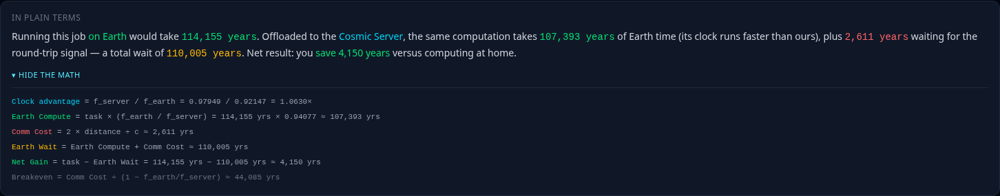

# Efficiency, Wait Time & Breakeven

How Void Ranger decides whether offloading a job to a deep-space server actually
beats running it on Earth — the math behind *Earth Compute Time*, *Earth Wait
Time*, *Net Gain/Loss*, and the *Breakeven workload*. All of this lives in
[`backend/app/services/physics.py`](../backend/app/services/physics.py)
(`compute_efficiency` and `breakeven_task_seconds`). It builds on the
[Gravitational Field Model](gravitational-field.md) (which produces the clock
factors `f_earth` and `f_server`) and the [Light-Speed Latency](light-latency.md)
model (which produces the round-trip delay).

## 1. The question

You have a job that needs `task` seconds of compute (on whatever machine runs it,
measured in *that machine's own clock*). You can run it locally on Earth, or ship
it to a server sitting in a gravitational void where the clock ticks faster. Is
the trip worth it? Three quantities answer that.



<sub><i>The core trade-off: a void's clock advantage grows with task size while light latency is a fixed cost — net gain = t·(1 − f_earth/f_server) − 2d/c.</i></sub>

## 2. The three quantities

From `compute_efficiency`:

```
earth_compute = task × (f_earth / f_server)
earth_wait    = earth_compute + latency
net_gain      = task − earth_wait
```

- **`earth_compute` (Earth Compute Time)** — how much time elapses *on Earth's
  clock* while the server crunches the job. The server does `task` seconds of work
  in its own proper time; because its clock runs faster than Earth's
  (`f_server > f_earth` in a void), fewer Earth-seconds pass. The ratio
  `f_earth / f_server` is `< 1` in a void, so `earth_compute < task` — the work
  effectively finishes *sooner* in Earth terms than running it locally.
- **`earth_wait` (Earth Wait Time)** — the *total* wall-clock time an Earth
  observer waits, end to end: the compute time **plus** the round-trip light delay
  (`latency`) to send the job and receive the result. It differs from
  `earth_compute` by exactly the [Communication Cost](light-latency.md).
- **`net_gain` (Net Gain / Loss)** — the bottom line: running it locally costs
  `task` Earth-seconds; offloading costs `earth_wait`. The difference is the
  saving. **Positive (green ▲)** = offloading wins; **negative (red ▼)** = the
  light-delay tax outweighs the dilation saving.

### Why the clock ratio is `f_earth / f_server`

`task` is the job's runtime in the *server's* proper time. To express that in
Earth time you scale by how Earth's clock compares to the server's:
`Earth time = server time × (rate_earth / rate_server) = task × (f_earth/f_server)`.
A faster server clock (`f_server` larger) shrinks that number — that's the whole
dilation advantage, in one ratio.

> **The two ratios are reciprocals — don't confuse them.** The dashboard shows
> the **Server Clock Advantage** as `f_server / f_earth` (e.g. `1.0478×` — "the
> server ticks 1.0478× faster"), but **Earth Compute Time** scales the task by
> the *flipped* ratio `f_earth / f_server` (e.g. `0.95437`). These are the same
> fact inverted: `0.95437 = 1 / 1.0478`, so
> `Earth Compute = task × (f_earth/f_server) = task ÷ (f_server/f_earth) = task ÷ advantage`.
> A faster clock means **less** Earth time passes, so you *divide* by the
> advantage. Using `1.0478×` here instead would give `~104,780 yr` for a
> 100,000-yr job — the work taking *longer* in Earth time despite the faster
> clock, which is backwards. The reciprocal is exactly what turns the faster
> clock into a time *saving*.

## 3. The breakeven workload

Substitute and rearrange. Net gain is positive only when:

```
net_gain = task × (1 − f_earth/f_server) − latency  >  0
```

Setting `net_gain = 0` and solving for `task` gives the **smallest job that pays
off at this location** (`breakeven_task_seconds`):

```
breakeven = latency / (1 − f_earth / f_server)
```

Two things fall out of this:

- **It depends only on the placement, not on your current task size.** The
  location fixes `latency` (via distance) and `f_server` (via local gravity), so
  the breakeven is a fixed property of *where* you put the server. Your task size
  just determines which side of it you land on (the UI colors the readout green
  when `task ≥ breakeven`, red otherwise).
- **It can be "none."** If `f_server ≤ f_earth` (the server is in a region as
  dense as, or denser than, Earth — `clock_advantage ≤ 1`), the denominator is
  `≤ 0`: there is **no** task size that ever wins, so `breakeven_task_seconds`
  returns `null` and the UI shows "none." This is the case when you park a server
  next to a massive star (see the [Gravitational Field Model](gravitational-field.md#6-worked-example-a-void-vs-next-to-a-massive-star)).

The fixed-cost / linear-benefit structure is why **big jobs justify the trip and
small ones don't**: the latency is a flat tax paid regardless of job size, while
the dilation saving grows linearly with the job. Below breakeven the tax
dominates; above it, the saving wins.



<sub><i>Net gain vs. distance at the solar scale (real model output): a 100,000-yr job stays net-positive and grows with void depth, a 30,000-yr job hovers near break-even, and a 10,000-yr job never pays off.</i></sub>



<sub><i>Break-even task size by scale (log axis): the smallest job worth offloading is ~10⁷ days at the solar scale and ~10¹²–10¹³ days at the cosmic / deep-field scales.</i></sub>

## 4. Worked example

A server deployed at galactic `(d = 400 pc, l = 30°, b = 40°)` — Cartesian
`(265.4, 153.2, 257.1)`, a deep void — with a **114,155-year** task
(`task ≈ 3.600×10¹² s`):

| Quantity | Value (seconds) | In years |
|----------|-----------------|----------|
| `f_earth` | 0.92147 | — |
| `f_server` | 0.97949 | — |
| **Clock Advantage** `f_server/f_earth` | 1.0630× | — |
| `latency` (round trip) | 8.235×10¹⁰ | 2,611 yrs |
| **Earth Compute Time** = task × (f_earth/f_server) | 3.3867×10¹² | ~107,393 yrs |
| **Earth Wait Time** = compute + latency | 3.4690×10¹² | ~110,004 yrs |
| **Net Gain** = task − wait | 1.309×10¹¹ | **~4,150 yrs** (green) |
| **Breakeven** = latency / (1 − f_earth/f_server) | 1.390×10¹² | **~44,084 yrs** |

**Step by step** — the clock factors `f_earth`, `f_server` come from the
[Gravitational Field Model](gravitational-field.md); the ratio `f_earth/f_server`
is unitless, so the arithmetic works directly in years:

```
Server Clock Advantage = f_server / f_earth
                       = 0.97949 / 0.92147   = 1.0630×

Earth Compute Time     = task × (f_earth / f_server)        ( = task ÷ advantage )
                       = 114,155 yr × (0.92147 / 0.97949)
                       = 114,155 yr × 0.94076               ( = 114,155 ÷ 1.0630 )
                       ≈ 107,393 yr

Communication Cost     = 2d / c                             ≈ 2,611 yr   (round trip)

Earth Wait Time        = Earth Compute Time + Communication Cost
                       = 107,393 yr + 2,611 yr             ≈ 110,004 yr

Net Gain               = Task Workload Size − Earth Wait Time
                       = 114,155 yr − 110,004 yr           ≈ 4,150 yr   (positive → green ▲)

Breakeven              = Communication Cost / (1 − f_earth/f_server)
                       = 2,611 yr / (1 − 0.94076)
                       = 2,611 yr / 0.05924                ≈ 44,084 yr
```

So **Net Gain draws on three on-screen metrics** — Task Workload Size, Earth
Compute Time (which in turn depends on the Server Clock Advantage), and
Communication Cost — via `Net Gain = Task − (Earth Compute Time + Communication Cost)`.

Reading it: the void runs 6.3% faster than Earth, so the 114,155-year job
finishes in ~107,393 Earth-years of compute; add the 2,611-year round trip and
you wait ~110,004 years — still ~4,150 years *less* than the 114,155 years it
would take on Earth. And since the task (114,155 yr) is well above the breakeven
(44,084 yr), the readout is green. Drop the task below 44,084 years and it would
flip to a net loss.

Reproduce it:

```bash
curl -s -X POST http://localhost:8000/api/physics/efficiency \
  -H 'Content-Type: application/json' \
  -d '{"x":265.37,"y":153.21,"z":257.12,"task_seconds":3599930880000}'
```

### Seeing it in the app

You don't have to read the table — the dashboard shows this same breakdown live.
The *In Plain Terms* panel under the metrics has a **"Show the math"** toggle that
expands the step-by-step formulas, recomputed for the current placement and
color-coded to match the metric cards:



It mirrors this section exactly: `clock advantage = f_server / f_earth`,
`Earth compute = task × (f_earth / f_server)`, `Earth wait = compute + comm cost`,
`net gain = task − wait`, and `breakeven = comm cost ÷ (1 − f_earth/f_server)`.

Note the **clock advantage** and **Earth compute** lines use *reciprocal*
ratios (`f_server/f_earth` vs. `f_earth/f_server`) — see [Why the clock ratio is
`f_earth / f_server`](#why-the-clock-ratio-is-f_earth--f_server) above. They look
mismatched at a glance but are the same number flipped, because a faster clock
means the job finishes in *less* Earth time.

## 5. Caveats

- **Identical hardware is assumed.** The model assumes the same job costs the same
  number of compute-seconds wherever it runs, each measured in that machine's own
  clock. Differences in real server speed are out of scope — the only thing that
  differs is clock *rate*.
- **`task` is the server's proper time.** You specify how long the job takes on
  the machine doing it; Earth time is derived.
- **Units are display-only.** The UI shows years (with a days line beneath), but
  every calculation here is in **seconds**; the conversion happens at the edges.
- **The dilation half is exaggerated.** `f_server`/`f_earth` come from the
  deliberately-scaled gravity model, so the *magnitude* of the gain isn't
  physical, though the trade-off structure is faithful. The latency half is real
  (`2d/c`).

## 6. Code map

| Piece | Location |
|-------|----------|
| `earth_compute`, `earth_wait`, `net_gain` | `compute_efficiency` — `backend/app/services/physics.py` |
| `breakeven = latency / (1 − f_earth/f_server)` | `breakeven_task_seconds` — same file |
| Clock factors `f_earth`, `f_server` | `earth_dilation_factor`, `server_dilation_factor` (see [Gravitational Field Model](gravitational-field.md)) |
| `latency` | `light_latency` (see [Light-Speed Latency](light-latency.md)) |
| API wiring | `efficiency()` in `backend/app/routers/physics.py` |
