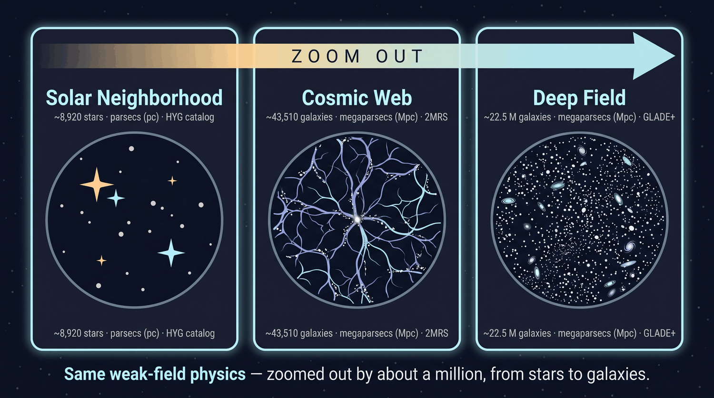

# Scaling the Universe — bigger catalogs, more reach

Options for growing Void Ranger beyond the ~8,920-star solar neighborhood it
ships with — toward many more objects and a much larger slice of the universe.
This is a **decision/reference doc** capturing the trade-offs; the chosen
direction (see [Decision](#decision)) gets its own implementation plan.

## Where we are today

- **8,920 stars**, apparent magnitude ≤ 6.5 — essentially the naked-eye
  **solar neighborhood** (median ~124 pc, ~95% within ~560 pc).
- Served as **one ~1.2 MB JSON** (`GET /api/stars`) and drawn as a single
  Three.js `<points>` cloud (`GalaxyMap.jsx`).
- The void finder sums a **softened Newtonian potential** `Φ = −Σ G·Mᵢ/√(r²+ε²)`
  over **every** star at **every** grid point — `O(grid × N_stars)`.

Growing the simulation pushes on three independent things: the **catalog**, the
**data pipeline + rendering**, and the **physics framing**. They scale
differently and should be reasoned about separately.

## The catalogs available

| Catalog | Size | Distance reach | Relevance |
|---|---|---|---|
| **HYG v4.2** (current source) | **119,614 stars** | local | We use only 8,920 — ~13× headroom for free by relaxing the magnitude cut |
| **AT-HYG v3** | ~118,971 | local, **Gaia DR3 distances** | Same schema as HYG, better/farther distances + velocities — near drop-in upgrade |
| **Tycho-2** | ~2.5 million | ~few hundred pc | Whole-sky bridge between HYG and Gaia |
| **Gaia DR3** | **~1.8 billion sources** (~1.5 B with parallax) | reliable to ~few kpc | Effectively unlimited stars; distances degrade past a few kpc |
| **Gaia DR4** | larger, more precise | — | Expected **no earlier than Dec 2026** |
| **2MRS** (2MASS Redshift Survey) | ~45,000 galaxies | every entry has a redshift/distance | Clean, **distance-complete** nearby cosmic-web layer |
| **GLADE+** | **22.5 M galaxies** + 750 k quasars | complete to ~44 Mpc (B-band), brightest to ~95 Mpc | Genuine big-data extragalactic catalog; **not every galaxy has a distance** (has a `dist` flag) |

Sources: [HYG database (astronexus)](https://codeberg.org/astronexus/hyg) ·
[Gaia spacecraft / data releases (Wikipedia)](https://en.wikipedia.org/wiki/Gaia_(spacecraft)) ·
[GLADE+ galaxy catalog](https://glade.elte.hu/).

## Three axes of expansion

### Option A — More stars, same neighborhood (cheap, immediate)
Relax the magnitude cut (6.5 → ~8–9) and/or switch to **AT-HYG**. Tens of
thousands of stars with *better* Gaia distances, **no architecture change** —
same JSON-and-points-cloud path. Biggest bang for least effort; makes the field
denser and the void finder more interesting (more real gaps).
- **Effort:** low. **Reach gained:** little (still local). **Risk:** minimal.

### Option B — Farther out with Gaia (medium → hard)
Hundreds of thousands to millions of stars out to ~kpc. This is where the
**engineering** bites (see [Bottlenecks](#the-two-real-bottlenecks)).
- **Caveat:** Gaia parallax distances become unreliable past a few kpc — deep
  placements are a probabilistic cloud, not crisp positions.
- **Effort:** high (needs binary payload + streaming + faster void search).
  **Reach gained:** large (galaxy-scale). **Risk:** medium.

### Option C — Galaxies & the cosmic web (the ambitious one) ⭐
A galaxy catalog at **Mpc–Gpc scale** with a real notion of cosmic voids (the
Local Void, Boötes void, the filament/void structure of the cosmic web). This is
a **second scene/scale**, not just more points.
- Using **GLADE+** (22.5 M) makes it *both* option C **and** a real big-data
  visualization; **2MRS** (~45 k, all with distances) gives a clean,
  distance-complete nearby layer.
- **The void finder points at *actual* catalogued cosmic voids.**
- **Effort:** high. **Reach gained:** enormous (observable-universe scale).
  **Risk:** medium–high (new scene, new data pipeline, physics reframing).

## The two real bottlenecks

1. **Getting the data to the browser.** A 1.2 MB JSON for 8,920 objects doesn't
   scale — full HYG as JSON is ~16 MB; millions is hopeless. Fixes, in order of
   effort:
   - **Binary payload** — `Float32` `x,y,z` `.bin` ≈ 12 bytes/object (1 M ≈ 12 MB,
     decoded straight into the GPU buffer); carry names/metadata only for the
     small labeled subset.
   - **Region/zoom tiling (octree)** — stream only what's in view / at the
     current zoom, à la Gaia Sky or potree.

2. **Void-search scaling.** Today `O(grid × N_stars)` — fine at 8,920, painful at
   millions. Decouple it from N:
   - **Precompute a 3-D potential field on a voxel grid** once (offline/cached);
     the finder then interpolates / min-searches the grid — *instant regardless
     of object count*. **Highest-leverage change for any scaling.**
   - Alternatives: **Barnes–Hut tree-code** or a **KD-tree**
     (`scipy.spatial.cKDTree`) for the sum.

Rendering is the *least* worrying part: one `bufferGeometry` comfortably handles
100 k–1 M points; past a few million you want LOD/streaming, but A and most of B
fit on the GPU as-is.

## The physics wrinkle (why scale *helps* the premise)

At star scale, "place a server in a void → weaker field → faster clock" uses a
**loose** notion of void (gaps between nearby stars), and the dilation is
deliberately **exaggerated** to be visible. At **galaxy/cluster scale the thesis
becomes literally true**: clocks in real cosmic voids genuinely tick faster than
clocks deep in galaxy clusters (gravitational redshift between voids and clusters
is a real, measured effect), and round-trip latency at Mpc distances lands
naturally in the app's existing **"years"** units. So Option C could let us
**shrink or drop the exaggeration constant** and present honest relativity — with
"Find deepest void" pointing at genuine cosmic voids.

## Google Cloud fit (for big-data reach)

If we push to millions of objects, GCP can carry the heavy parts (sketch — to be
firmed up in the plan):
- **BigQuery** — load/query a large catalog (Gaia, GLADE+) to spatially filter,
  rank, and **downsample/tile** tens of millions of rows without local compute.
- **Cloud Storage (+ Cloud CDN)** — serve precomputed **binary tiles** (positions
  + LOD levels) and the precomputed potential grid as static, cacheable assets.
- **Cloud Run** — host the FastAPI backend (already container-friendly) for the
  metric/void-search endpoints near the data.
- A one-time **batch job** (local, Cloud Run job, or Dataflow) builds the tiles +
  potential grid; the runtime then just streams static assets.

## Decision

**Chosen direction: Option C (cosmic web), prioritizing reach, staying a teaching
tool while pushing real big-data visualization, using Google Cloud where it
helps.** Rationale: C maximizes *reach* (observable-universe scale), is the most
compelling teaching story, makes the physics more honest, and — via GLADE+ —
doubles as the big-data visualization goal. Implementation details live in the
Option-C plan.

## Status

<i>The same weak-field physics at three scales — Solar Neighborhood (8,920 stars, pc), Cosmic Web (43,510 galaxies, Mpc), and Deep Field (~22.5 M galaxies, Mpc).</i>

- ✅ **Phase 1 — Cosmic-web MVP on 2MRS (shipped):** a Solar Neighborhood ↔
  Cosmic Web scale toggle backed by ~43,500 2MRS galaxies, scale-parameterized
  physics, and the void finder targeting real cosmic voids. See
  [The Cosmic Web scale](cosmic-web.md).
- ✅ **Phase 2 — GLADE+ big-data Deep Field (shipped):** a third **Deep Field**
  scale on **GLADE+** (~22.5 M galaxies) — binary octree LOD tiles streamed into
  the point cloud and a precomputed 3-D potential grid that makes the void search
  **O(voxels)**, independent of catalog size. Built by a GCP-ready pipeline
  (GLADE+ → GCS → BigQuery → tiles/grid → GCS/Cloud CDN) and runnable locally
  from committed sample assets; full GCP provisioning is a separate, documented,
  user-run suite. See [The Deep Field scale](deep-field.md). Implemented per plan
  [003](plans/003-cosmic-web-phase-2-deep-field.md).
